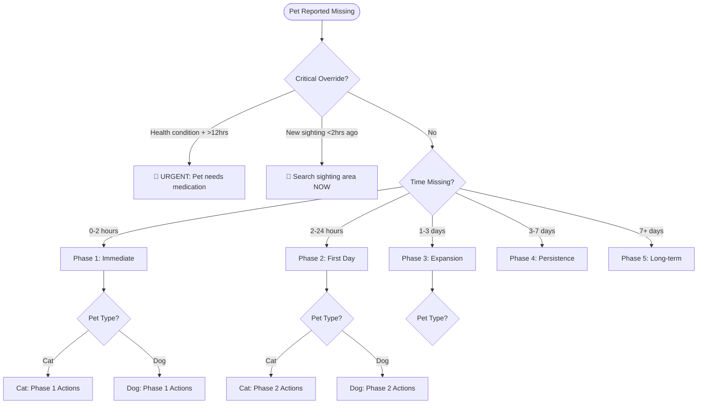
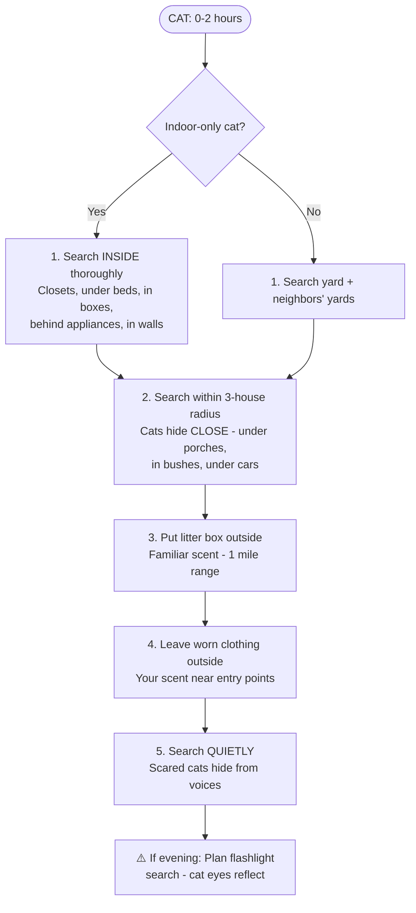
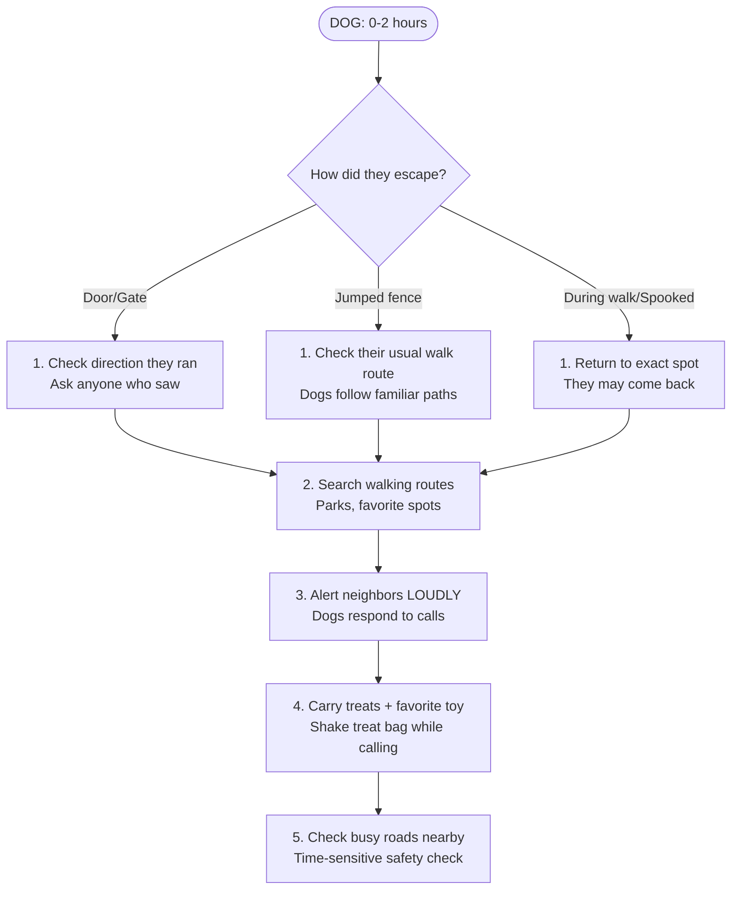
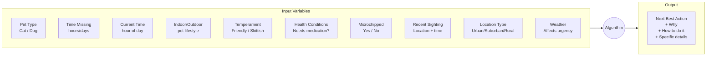
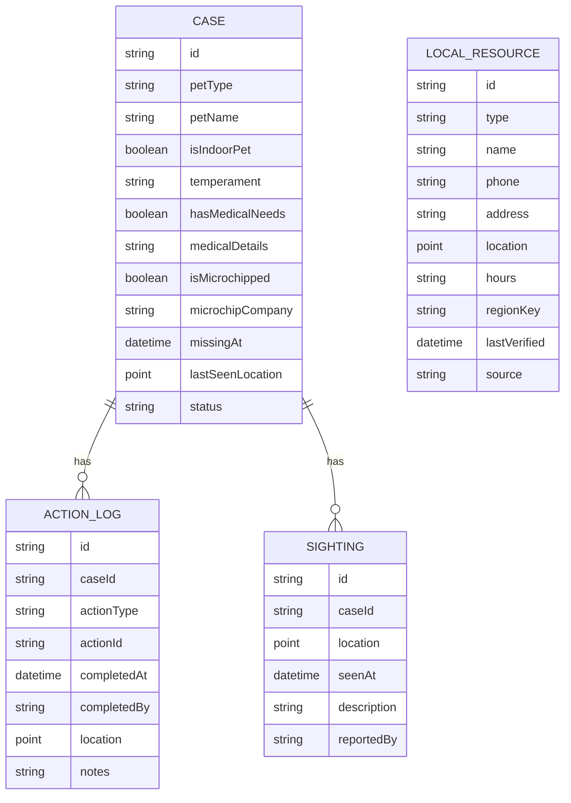

# Lost Pet Actions - Decision Logic Flowchart

Paste the mermaid blocks into https://mermaid.live to visualize.

---

## Master Flow

---

## Phase 1: Immediate (0-2 hours)

### CAT - Phase 1

### DOG - Phase 1

---

## Phase 2: First Day (2-24 hours)

### Time-of-Day Logic

### CAT - Phase 2 Specifics

### DOG - Phase 2 Specifics

---

## Phase 3: Expansion (1-3 days)

---

## Variables Reference

---

## Backend Data Model

---

## Action Types Master List

| ID | Action | Pet | Phase | Requires |
|----|--------|-----|-------|----------|
| `search_inside` | Search inside home thoroughly | Cat | 1 | - |
| `search_yard` | Search yard + 3-house radius | Both | 1 | - |
| `litter_outside` | Put litter box outside | Cat | 1 | - |
| `scent_clothes` | Leave worn clothes outside | Both | 1 | - |
| `call_shelters` | Call nearby shelters | Both | 2 | Shelter data |
| `call_vets` | Call local vet clinics | Both | 2 | Vet data |
| `notify_microchip` | Notify microchip company | Both | 2 | isMicrochipped |
| `post_flyers` | Print and post flyers | Both | 2 | Flyer generator |
| `dawn_search` | Physical search at dawn | Both | 2+ | Time = 5-7am |
| `dusk_search` | Physical search at dusk | Both | 2+ | Time = 5-8pm |
| `night_flashlight` | Flashlight search for eye reflection | Cat | 2+ | Time = night |
| `setup_camera` | Food station with camera | Both | 2 | - |
| `check_hiding` | Check sheds, garages, under decks | Cat | 2 | - |
| `alert_delivery` | Alert mail/delivery people | Both | 2 | - |
| `humane_trap` | Set up humane trap | Cat | 3 | Skittish cat |
| `expand_flyers` | Expand flyer radius | Both | 3 | - |
| `check_online` | Check shelter sites, Craigslist | Both | 3+ | - |
