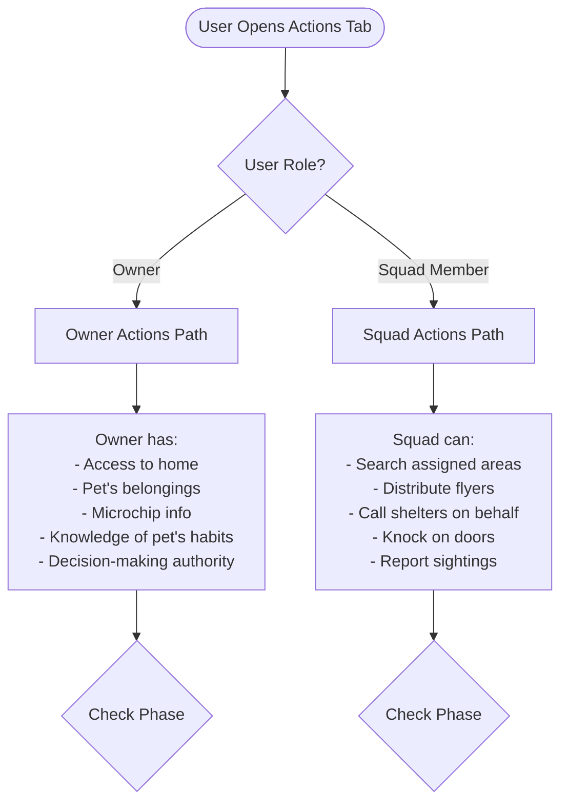
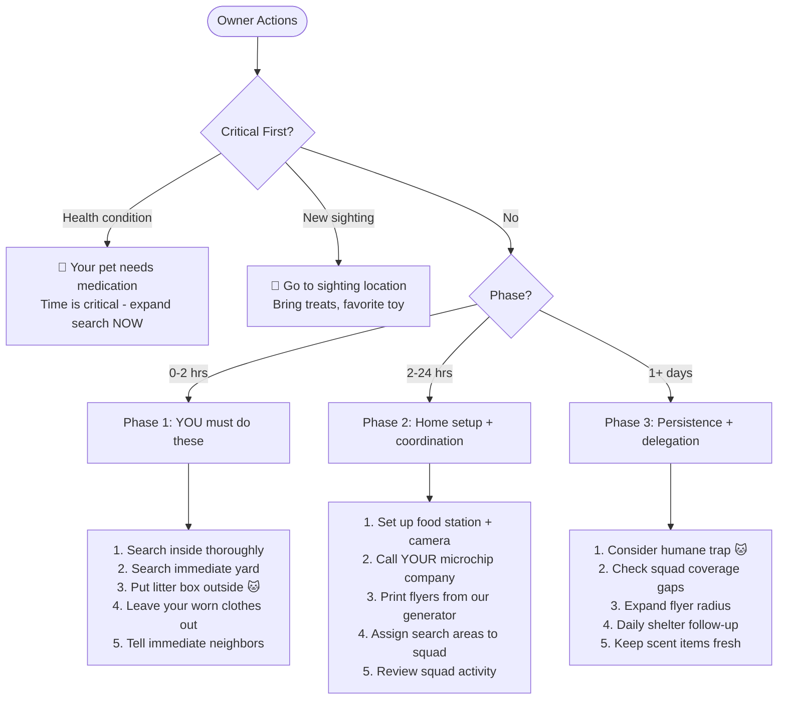
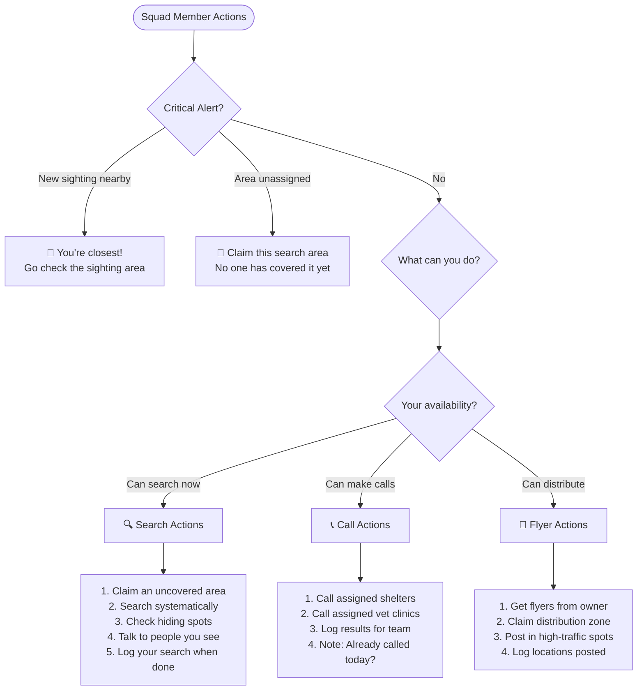
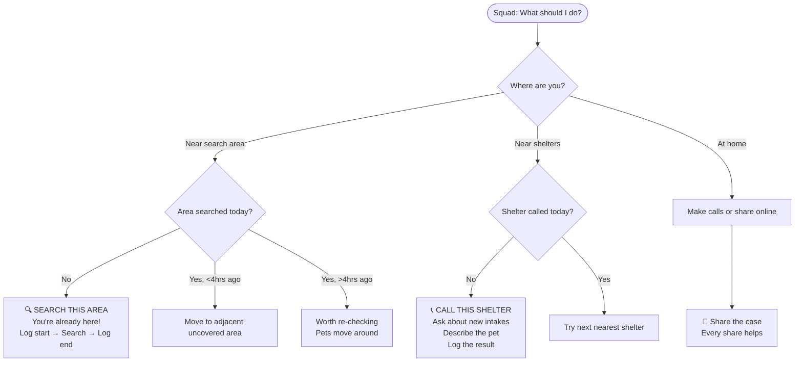
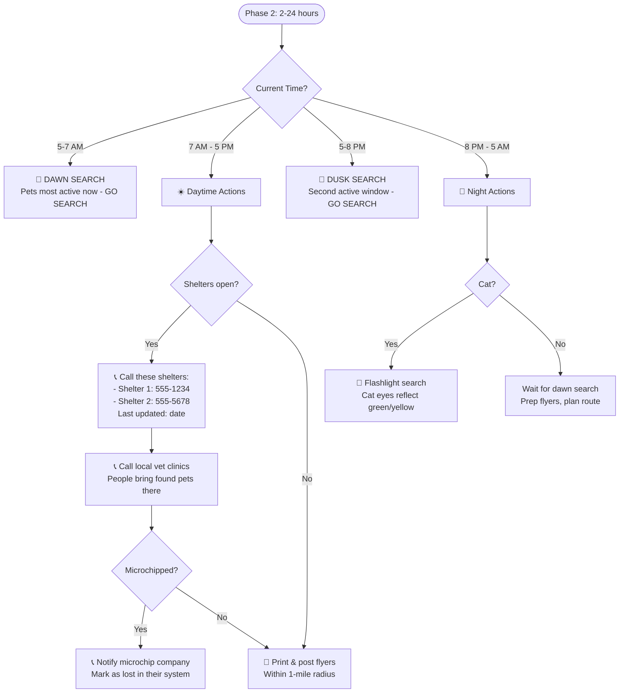
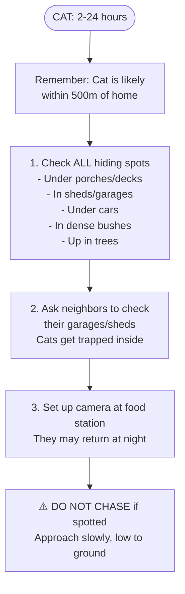
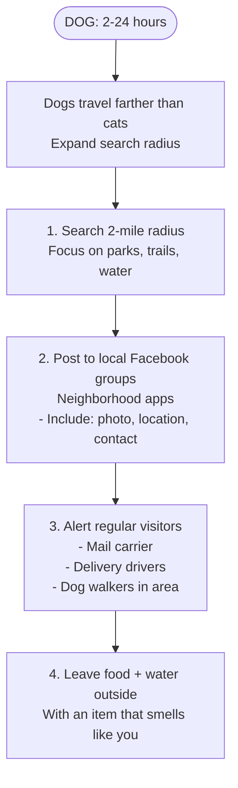
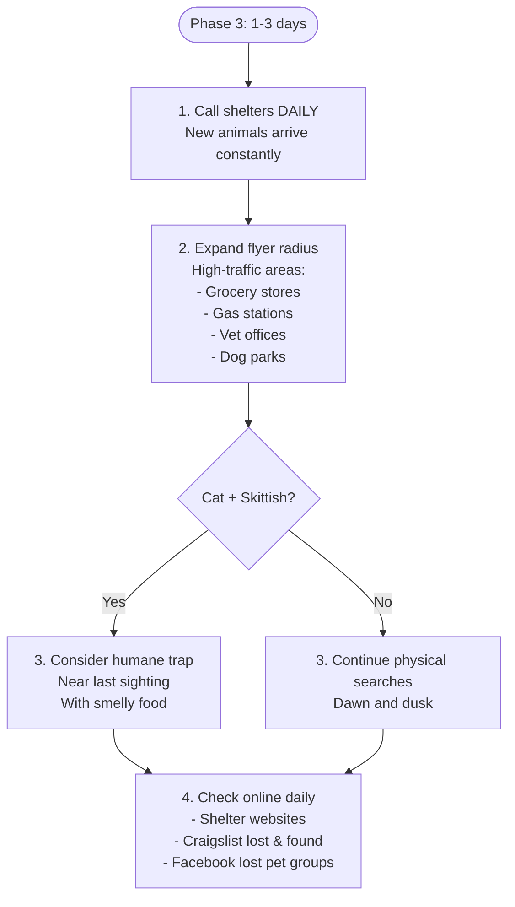
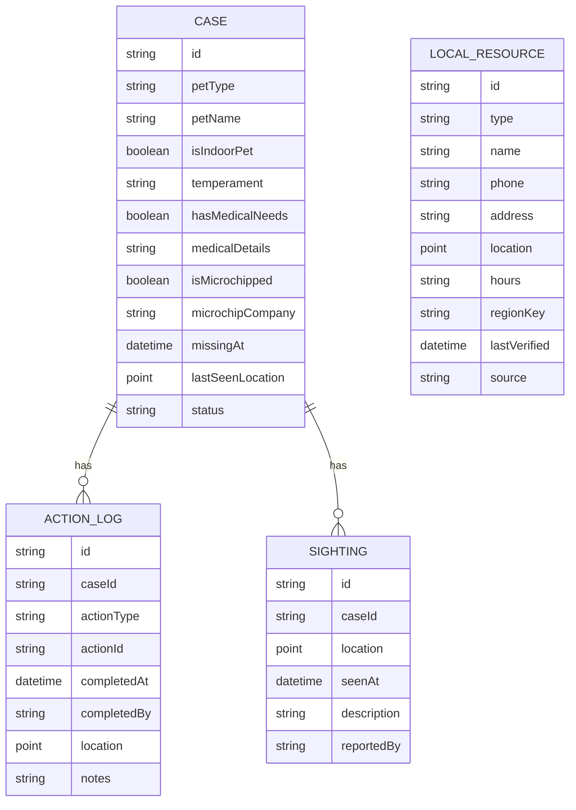

# Lost Pet Actions - Decision Logic Flowchart

Paste the mermaid blocks into https://mermaid.live to visualize.

---

## UI Design: Shared Mission Board

### Main View (List)
```
┌─────────────────────────────────────────────────┐
│  ACTIONS                          [+ Add Task]  │
├─────────────────────────────────────────────────┤
│                                                 │
│  OWNER TASKS (only owner can do these)          │
│  sorted by algorithm priority ↓                 │
│  ┌─────────────────────────────────────────┐   │
│  │ 1. ⚪ Put litter box outside            │   │
│  │ 2. 🟡 Search inside     [Sarah - 5m]    │   │
│  │ 3. ⚪ Set up camera trap                │   │
│  │ 4. ✅ Called HomeAgain  [Sarah - 1h]    │   │
│  └─────────────────────────────────────────┘   │
│                                                 │
│  SQUAD TASKS (anyone can help)                  │
│  sorted by algorithm priority ↓                 │
│  ┌─────────────────────────────────────────┐   │
│  │ 1. ⚪ Call Austin Animal Shelter        │   │  ← Highest priority
│  │ 2. ⚪ Call Town Lake Animal Center      │   │
│  │ 3. 🟡 Search Oak Park    [Mike - 10m]   │   │  ← Someone's on it
│  │ 4. ⚪ Search Zilker area                │   │
│  │ 5. ⚪ Post flyers - Main St             │   │
│  │ 6. ✅ Called Emancipet   [Jen - 2h]     │   │  ← Done
│  └─────────────────────────────────────────┘   │
│                                                 │
│  Legend: ⚪ Available  🟡 In Progress  ✅ Done  │
└─────────────────────────────────────────────────┘
```

### Full-Screen Task View (tap to expand)
```
┌─────────────────────────────────────────────────┐
│  ← Back                              Priority 1 │
├─────────────────────────────────────────────────┤
│                                                 │
│  📞 Call Austin Animal Shelter                  │
│  ━━━━━━━━━━━━━━━━━━━━━━━━━━━━━━━━━━━━━━━━━━━━  │
│                                                 │
│  WHY THIS IS #1 RIGHT NOW                       │
│  ┌─────────────────────────────────────────┐   │
│  │ • It's been 6 hours - shelters are key  │   │
│  │ • This shelter is closest (2.3 mi)      │   │
│  │ • They're open now (closes 7pm)         │   │
│  │ • No one has called them yet            │   │
│  └─────────────────────────────────────────┘   │
│                                                 │
│  WHAT TO SAY                                    │
│  ┌─────────────────────────────────────────┐   │
│  │ "Hi, I'm looking for a lost cat.        │   │
│  │  Orange tabby, male, about 2 years old, │   │
│  │  no collar. Lost near 45th & Duval      │   │
│  │  around 2pm today. Have you had any     │   │
│  │  cats brought in today?"                │   │
│  └─────────────────────────────────────────┘   │
│                                                 │
│  CONTACT                                        │
│  📞 (512) 978-0500                              │
│  📍 7201 Levander Loop, Austin TX               │
│  🕐 Open 11am-7pm (Open now)                    │
│  ℹ️  Data last updated: Dec 1, 2025             │
│                                                 │
│  ━━━━━━━━━━━━━━━━━━━━━━━━━━━━━━━━━━━━━━━━━━━━  │
│                                                 │
│  ┌─────────────────────────────────────────┐   │
│  │         📞 TAP TO CALL                   │   │
│  └─────────────────────────────────────────┘   │
│                                                 │
│  ┌─────────────────────────────────────────┐   │
│  │     🟡 I'M CALLING NOW                   │   │
│  │     (others will see you're on it)      │   │
│  └─────────────────────────────────────────┘   │
│                                                 │
│  ┌─────────────────────────────────────────┐   │
│  │     ✅ DONE - NO MATCH                   │   │
│  └─────────────────────────────────────────┘   │
│  ┌─────────────────────────────────────────┐   │
│  │     ✅ DONE - POSSIBLE MATCH!            │   │
│  │     (alert owner immediately)           │   │
│  └─────────────────────────────────────────┘   │
│                                                 │
└─────────────────────────────────────────────────┘
```

### Task States
```
⚪ AVAILABLE    → Anyone can claim it
🟡 IN_PROGRESS  → Someone's working on it (shows who + duration)
✅ COMPLETED    → Done (shows who + when + result)
🔴 BLOCKED      → Can't do yet (e.g., shelter closed, waiting on owner)
```

### Priority Algorithm (simplified)
```
score = base_priority
      + time_urgency_bonus      (first 24hrs = +100)
      + time_of_day_bonus       (shelter open now = +50)
      + not_done_yet_bonus      (never called = +30)
      + proximity_bonus         (user is nearby = +20)
      - already_in_progress     (someone on it = -1000)
      - recently_completed      (done <4hrs ago = -500)
```

---

## Role-Based Split (CRITICAL)



---

## Owner vs Squad - Action Ownership

| Action | Owner | Squad | Notes |
|--------|:-----:|:-----:|-------|
| Search inside home | ✅ | ❌ | Only owner has access |
| Put litter box outside | ✅ | ❌ | Owner has the litter box |
| Leave scent items outside | ✅ | ❌ | Owner's scent matters |
| Set up camera at home | ✅ | ❌ | Owner's property |
| Notify microchip company | ✅ | ❌ | Owner has the info |
| Set humane trap at home | ✅ | ❌ | Owner's property |
| Call shelters | ✅ | ✅ | Squad can help call |
| Call vet clinics | ✅ | ✅ | Squad can help call |
| Physical search | ✅ | ✅ | Coordinate areas |
| Post flyers | ✅ | ✅ | Owner prints, squad distributes |
| Knock on doors | ✅ | ✅ | Squad can cover more ground |
| Alert delivery people | ✅ | ✅ | Anyone can do |
| Check hiding spots | ✅ | ✅ | Squad checks other areas |
| Report sighting | ✅ | ✅ | Anyone can report |
| Share on social media | ✅ | ✅ | More shares = better |

---

## Owner-Specific Flow



---

## Squad Member Flow



---

## Squad: "What Can I Do Right Now?"



---

## Master Flow


---

## Phase 1: Immediate (0-2 hours)

### CAT - Phase 1


### DOG - Phase 1


---

## Phase 2: First Day (2-24 hours)

### Time-of-Day Logic


### CAT - Phase 2 Specifics


### DOG - Phase 2 Specifics


---

## Phase 3: Expansion (1-3 days)



---

## Backend Data Model



---

## Action Types Master List

| ID | Action | Pet | Phase | Role | Requires |
|----|--------|-----|-------|------|----------|
| `search_inside` | Search inside home thoroughly | Cat | 1 | Owner | - |
| `search_yard` | Search yard + 3-house radius | Both | 1 | Owner | - |
| `search_area` | Search assigned area | Both | 1+ | Squad | Claimed area |
| `litter_outside` | Put litter box outside | Cat | 1 | Owner | - |
| `scent_clothes` | Leave worn clothes outside | Both | 1 | Owner | - |
| `call_shelter` | Call specific shelter | Both | 2 | Both | Shelter data |
| `call_vet` | Call specific vet clinic | Both | 2 | Both | Vet data |
| `notify_microchip` | Notify microchip company | Both | 2 | Owner | isMicrochipped |
| `print_flyers` | Print flyers | Both | 2 | Owner | Flyer generator |
| `post_flyers` | Distribute flyers in zone | Both | 2 | Squad | Flyers from owner |
| `dawn_search` | Physical search at dawn | Both | 2+ | Both | Time = 5-7am |
| `dusk_search` | Physical search at dusk | Both | 2+ | Both | Time = 5-8pm |
| `night_flashlight` | Flashlight search | Cat | 2+ | Both | Time = night |
| `setup_camera` | Food station with camera | Both | 2 | Owner | At home |
| `check_hiding` | Check sheds, garages, decks | Cat | 2 | Both | - |
| `alert_delivery` | Alert mail/delivery people | Both | 2 | Both | - |
| `knock_doors` | Knock on doors in area | Both | 2 | Squad | Assigned zone |
| `humane_trap` | Set up humane trap | Cat | 3 | Owner | Skittish cat |
| `expand_flyers` | Expand flyer radius | Both | 3 | Both | - |
| `check_online` | Check shelter sites daily | Both | 3+ | Both | - |
| `review_coverage` | Review squad search coverage | Both | 2+ | Owner | Has squad |
| `claim_area` | Claim uncovered search area | Both | 1+ | Squad | GPS |
| `report_sighting` | Report a sighting | Both | Any | Both | - |
| `share_case` | Share case on social media | Both | Any | Both | - |

---

## Variables Reference (Updated)

```mermaid
flowchart LR
    subgraph INPUTS[Input Variables]
        USER_ROLE[User Role<br/>Owner / Squad]
        PET_TYPE[Pet Type<br/>Cat / Dog]
        TIME_MISSING[Time Missing<br/>hours/days]
        CURRENT_TIME[Current Time<br/>hour of day]
        INDOOR_OUTDOOR[Indoor/Outdoor<br/>pet lifestyle]
        TEMPERAMENT[Temperament<br/>Friendly / Skittish]
        HEALTH[Health Conditions<br/>Needs medication?]
        MICROCHIP[Microchipped<br/>Yes / No]
        SIGHTING[Recent Sighting<br/>Location + time]
        USER_LOCATION[User Location<br/>GPS coordinates]
        SQUAD_ACTIVITY[Squad Activity<br/>What's been done]
    end

    subgraph OUTPUTS[Output]
        NEXT_ACTION[Next Best Action<br/>+ Why this matters<br/>+ Specific instructions<br/>+ Required resources]
    end

    INPUTS --> ALGORITHM((Role-Based<br/>Algorithm))
    ALGORITHM --> OUTPUTS
```


