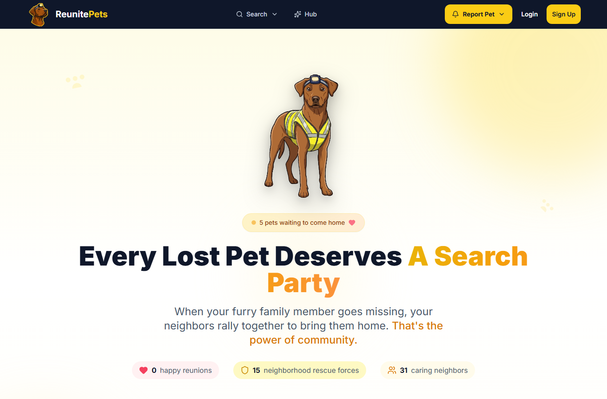
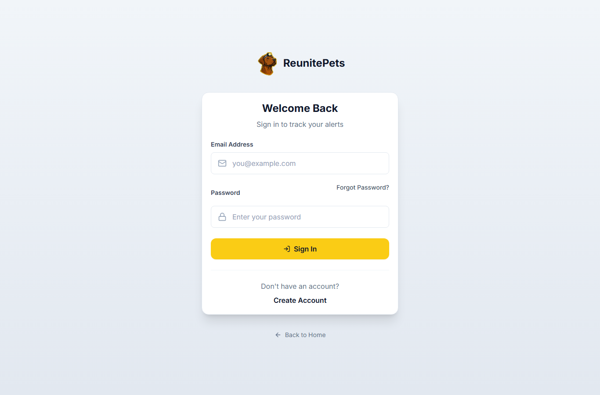
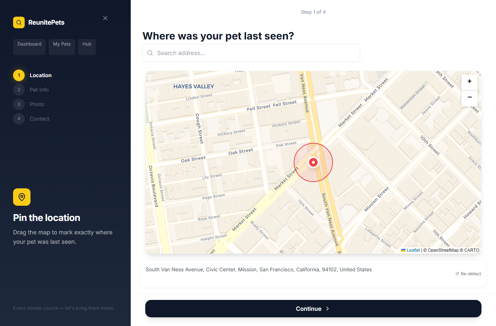
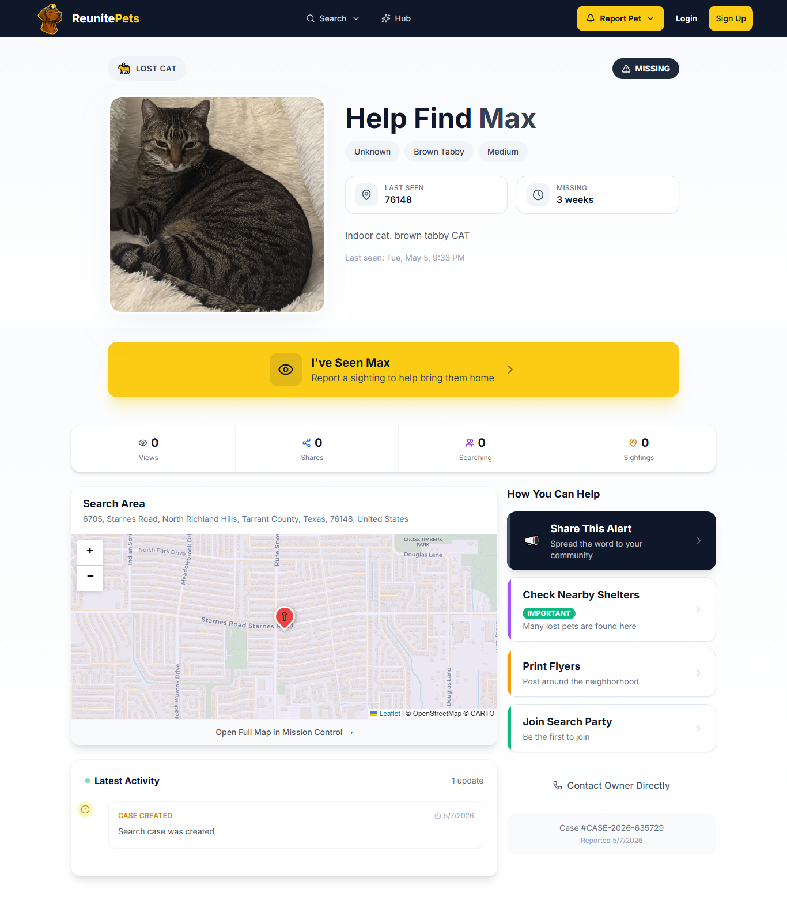
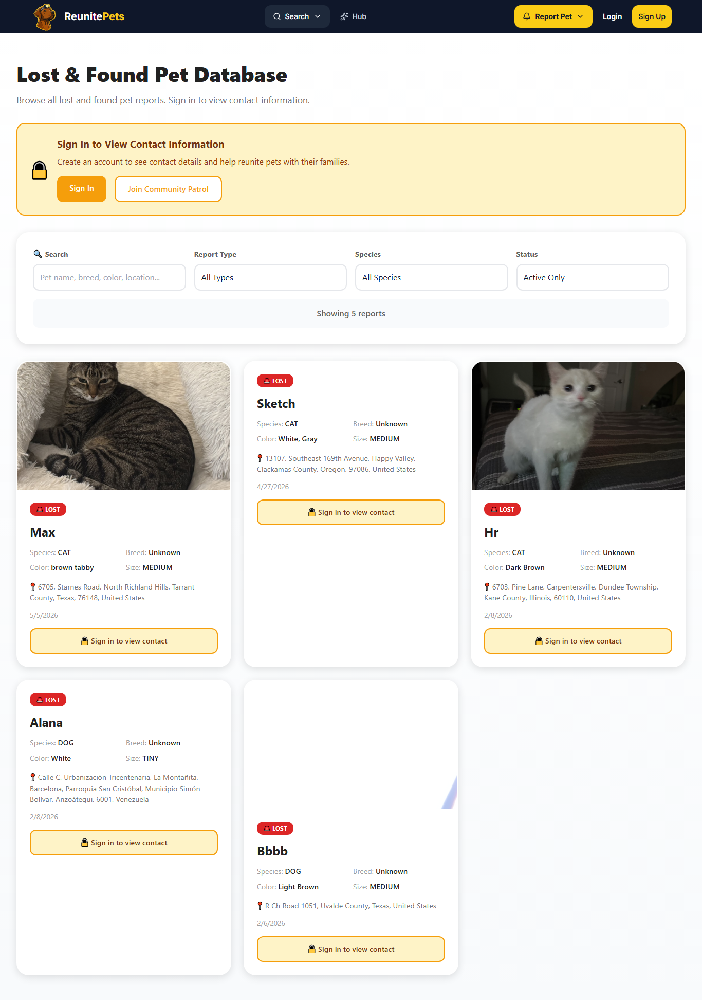
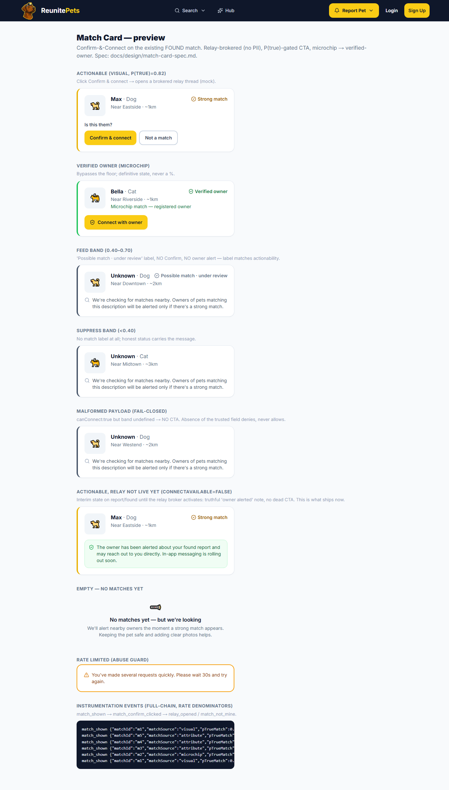
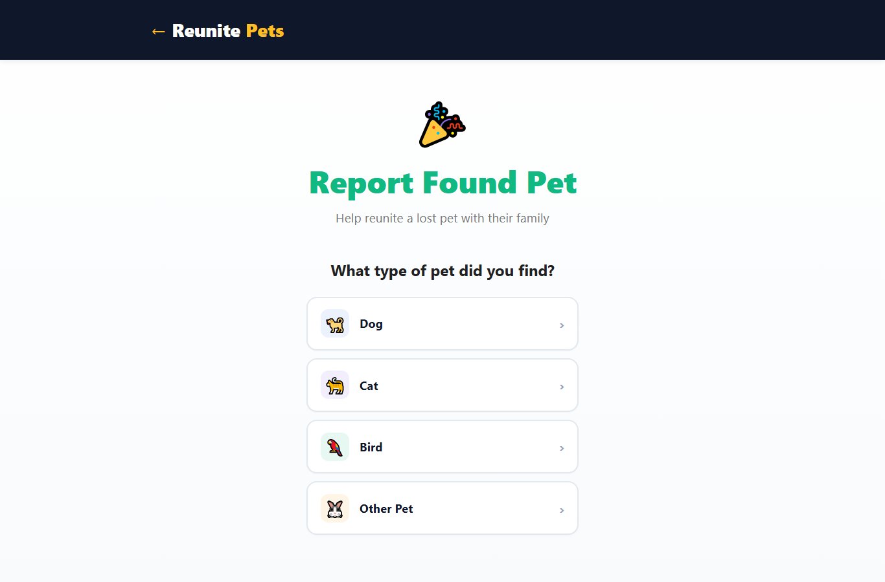
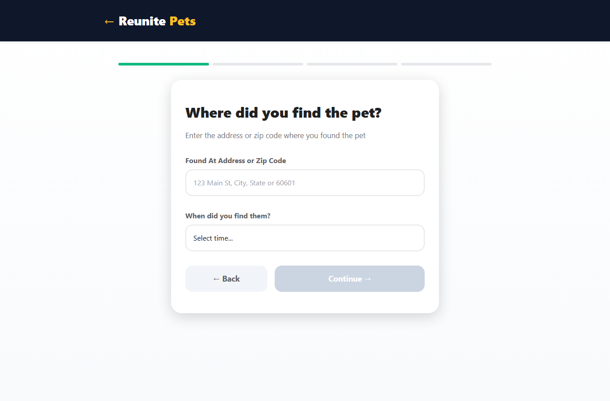
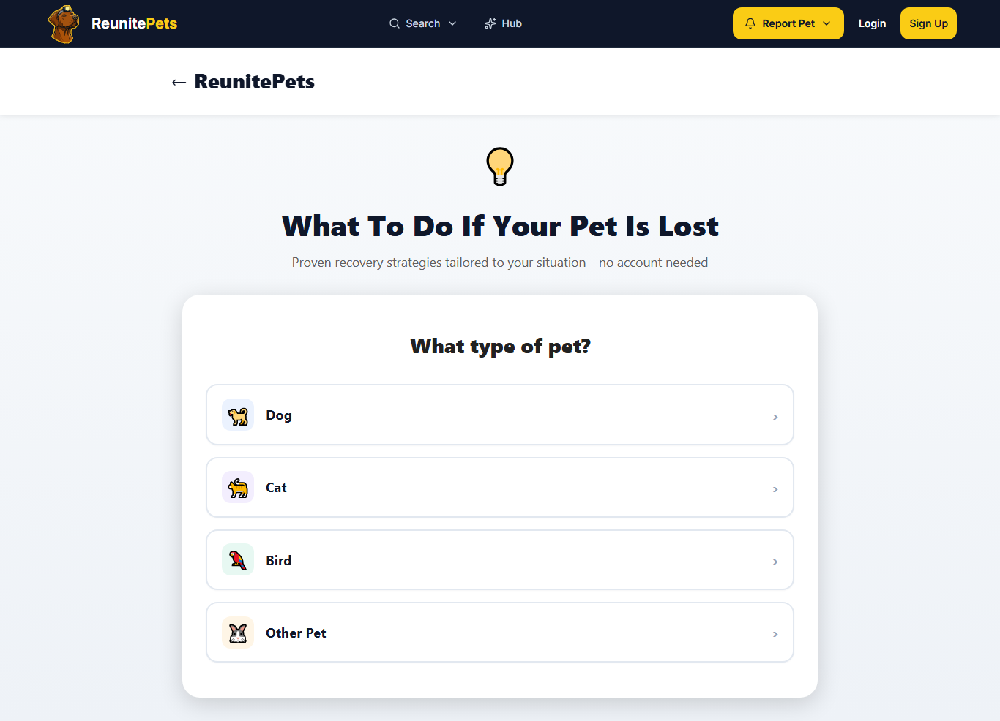
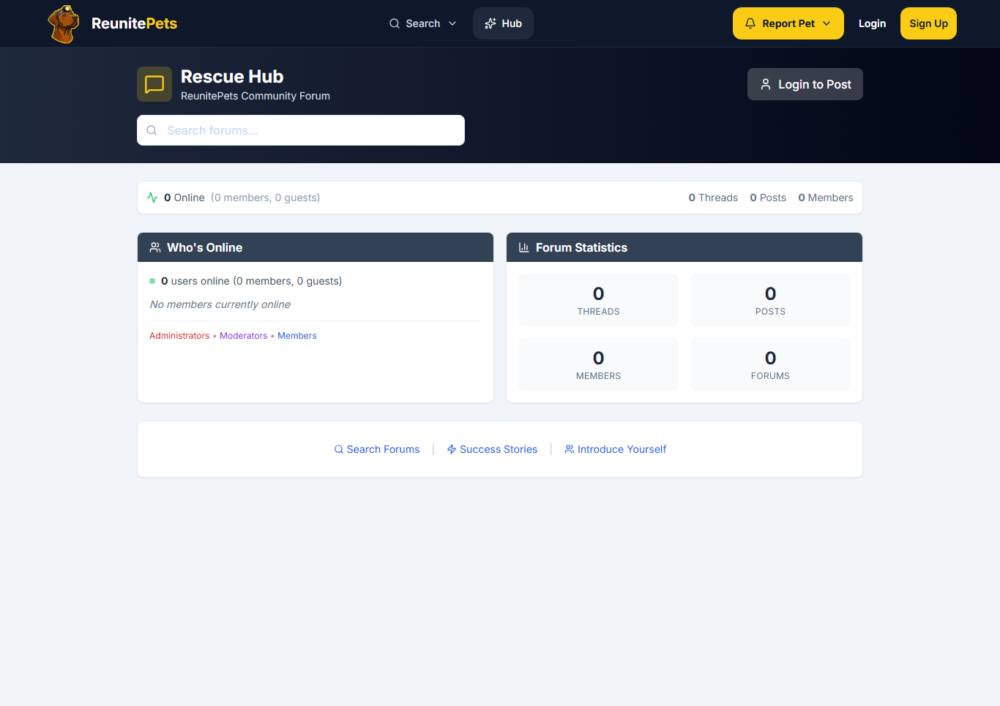

# UI Architect — UX Screenshot Gallery

Screenshot-driven UX record from the build session (per the "screenshot to observe UX" directive). Captured via the headless-Chrome harness in `frontend/scripts/` (`node scripts/shoot.mjs`). These shots **drove** the work — they're how the dashboard P1 crash and the off-brand pages were caught, and how every restyle was verified on-brand before committing. Desktop shots shown; the harness also captures mobile. Regenerate any time with the harness.

## Public surfaces — verified on-brand (midnight + flash design system)

### Landing hero

Friendly vested-dog mascot, bold headline with flash-gradient accent, live "pets waiting" badge, stats row. (Earlier "blank hero" worry was a capture artifact — DOM probe confirmed it renders.)

### Sign in

Polished, on-brand: logo, "Welcome Back", iconed inputs, flash-yellow Sign In.

### Report a Lost Pet — the wizard

On-system: midnight sidebar, step indicator, Leaflet map with radius, midnight Continue.

### Public case poster (the shareable distribution artifact)

"Help Find Max" with flash accent, prominent "I've Seen Max" sighting CTA, and Share / Flyers / Shelters / Join-Search actions already present.

### Lost & Found database (public search)

Midnight header, flash "Sign in to view contact" banner, clean pet cards with LOST badges.

## My UI deliverables

### MatchCard — the "Is this them?" match moment (all states)

Band-driven, fail-closed Confirm-&-Connect CTA, microchip→Verified-owner, honest "owner alerted" interim, empty + rate-limited states. Text+icon confidence (WCAG). Backed by a 9-case unit test green in the CI gate. (`/dev/match-card-preview` — dev-only, gate before prod.)

### Found-flow restyle (the prioritized finder funnel)

Pet-type selector restyled off saturated full-color buttons → clean white design-system cards with subtle emoji chips + chevrons.

Emerald progress bar + consistent emerald primary CTA (red was the LOST semantic; FOUND uses emerald).

### Design-system + brand fixes

`/advice` re-themed off the legacy warm/cyan `theme.js` palette → midnight/flash, high-contrast headings, design-system cards. (Plus brand: PetRecovery.org → ReunitePets.)

Rescue Hub banner: clashing blue → on-brand midnight gradient + flash icon, blending into the global nav.

## Coverage note
Public surfaces: fully audited + on-brand (above). Authed surfaces (squad hub, mission-control, admin) are pending a verified test credential — the visual sweep runs in one shot once a working login is available.
